# FamilyPlanner

FamilyPlanner ist eine private Webanwendung, die von meiner Familie im Alltag genutzt wird. Sie hilft uns, Termine, Aufgaben, Notizen, Kontakte, Essenspläne und Einkäufe gemeinsam zu organisieren - einfach und zuverlässig. Die App läuft als PWA auf unseren Handys und wird von mir weiterentwickelt, wenn im Alltag neue Wünsche oder Ideen entstehen.

---

## Eindrücke aus der App

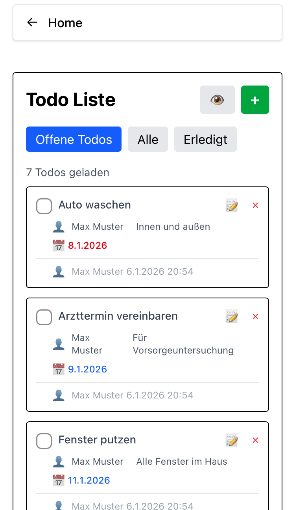
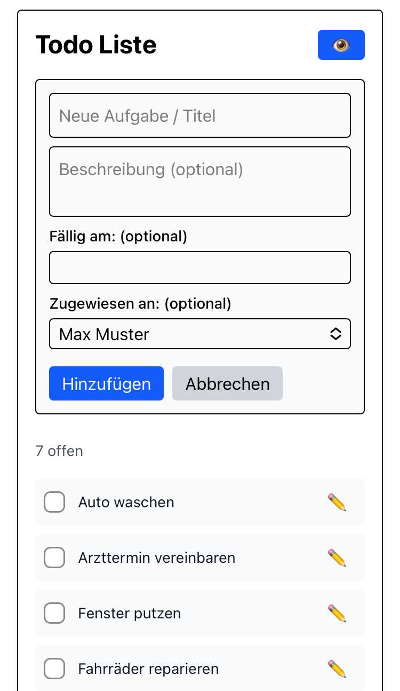
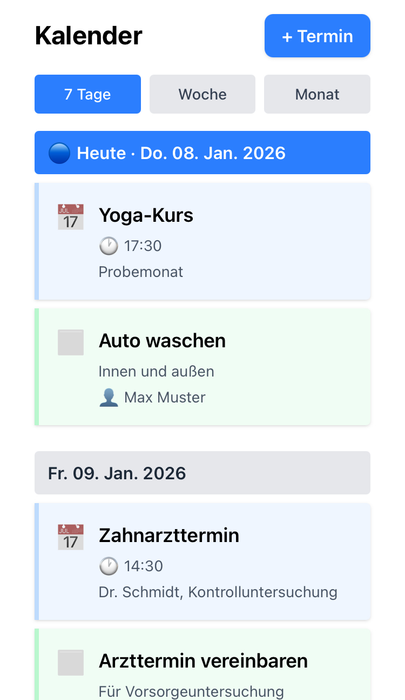
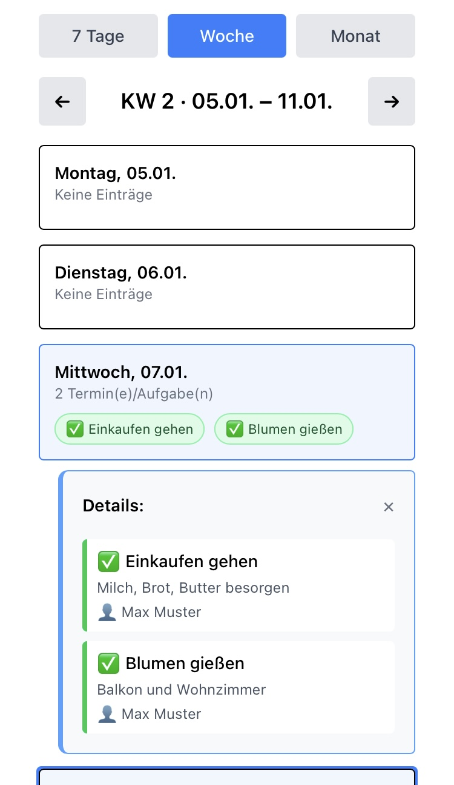

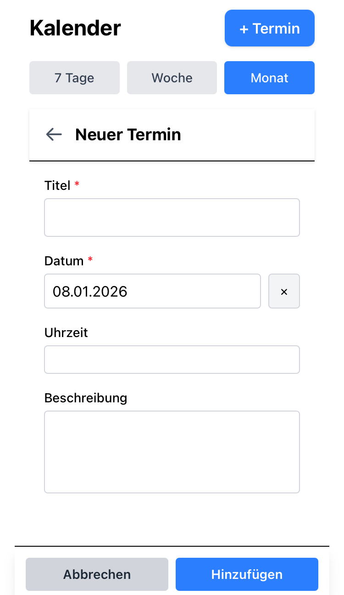
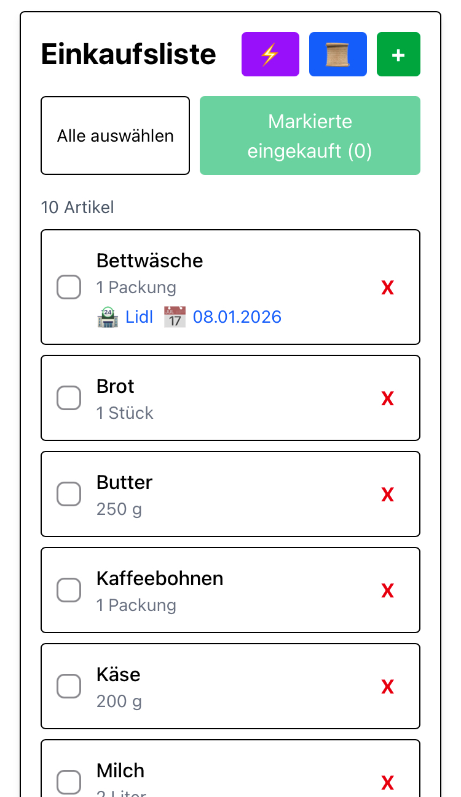
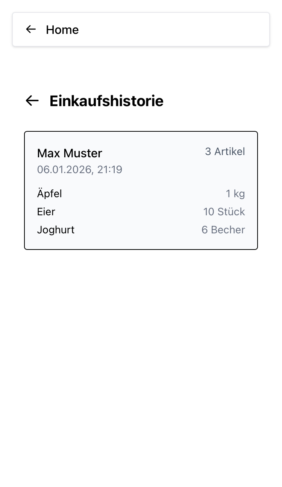
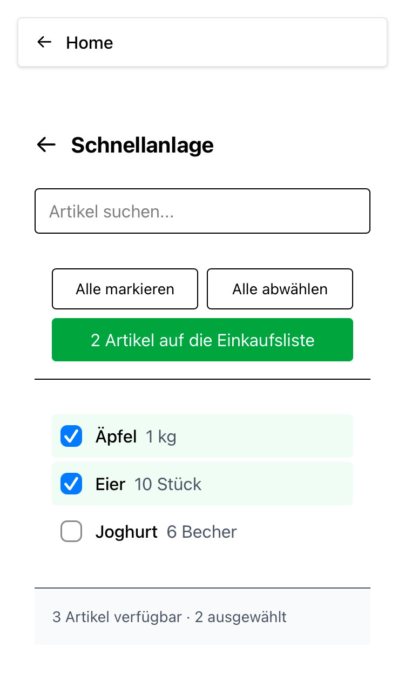
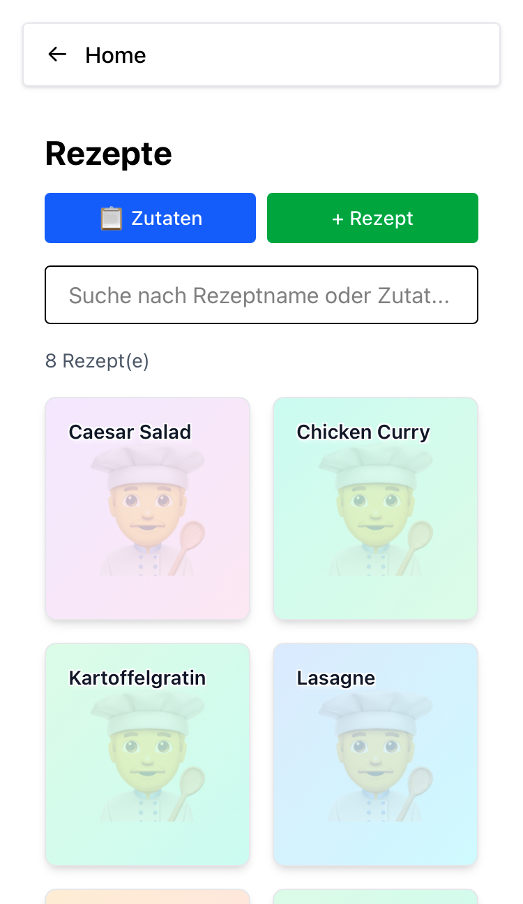
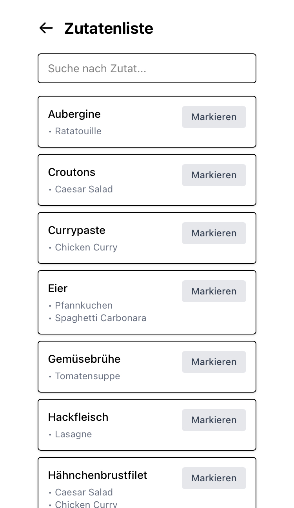
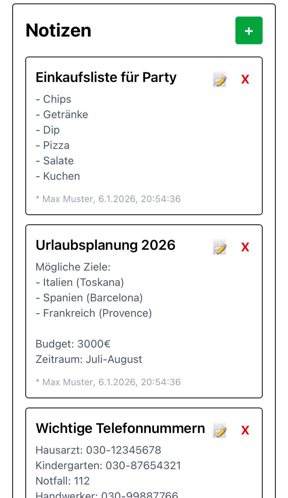
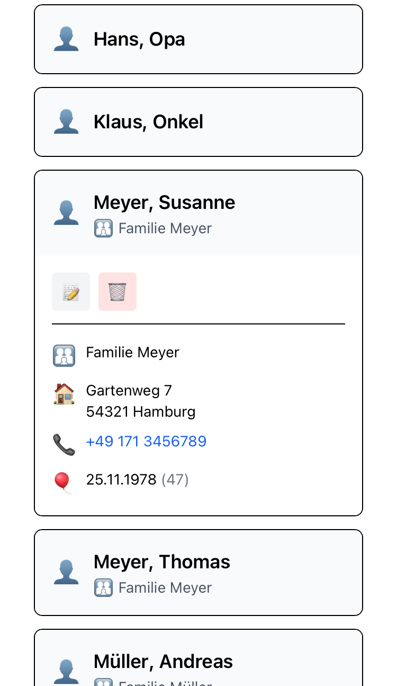
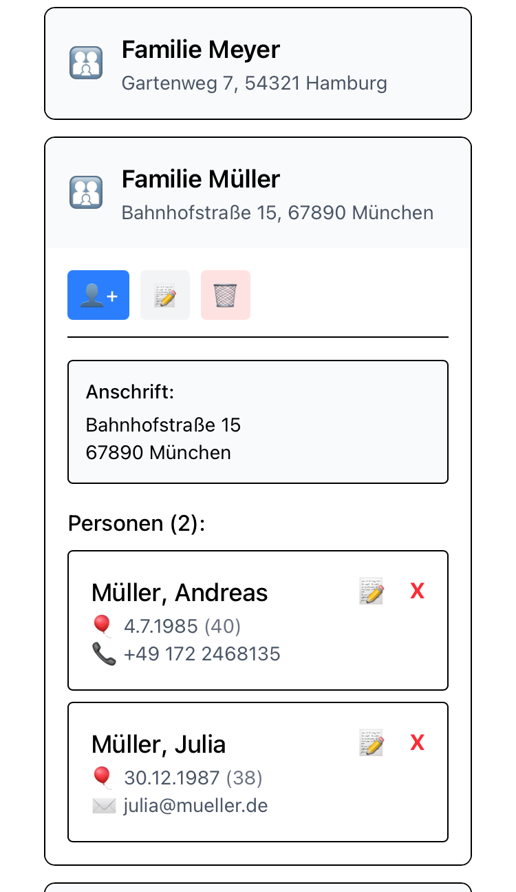

## Funktionen

- **Aufgaben/Todos:** Aufgabenlisten, Filter, Zuweisung an Personen, Fälligkeitsdaten, Kommentarfunktion
- **Notizen:** Einfache Notizerfassung und Bearbeitung
- **Einkaufsliste:** Einkaufsliste mit Checkboxen, Schnellanlage, Verlauf, Erfassen zeitlicher Angebote
- **Rezepte:** Anlegen eigener Rezepte, Erstellen von Kochplänen und Setzen von Zutaten auf Einkaufslisten, Zutatenlisten, Bearbeiten & Suchen
- **Kontakte:** Verwaltung von Personen und Gruppieren in Familien, Adressen, Kontaktdetails und Geburtstage
- **Kalender:** Tages-, Wochen- und Monatsansicht, Anlegen und Bearbeiten von Terminen, Anzeige von Todo-Fristen, Shopping-Angeboten und Geburtstagen

- **Push-Benachrichtigungen:** Tägliche Erinnerung für heutige Termine, Todo Fristen und Deal Angeboten aus der Einkaufsliste
- **PWA:** Installierbar auf iOS/Android

---

## Tech-Stack

- **Frontend:** JavaScript/TypeScript, React, Tailwind CSS, Vite
- **Backend:** Supabase (PostgreSQL-Datenbank, Auth, Realtime, Edge Functions, Cron Jobs)
- **Testing:** Vitest (React Testing Library)
- **Deployment:** Vercel

---

## Ausprobieren & Testzugang

Die App ist öffentlich erreichbar und kann mit generierten Demodaten getestet werden. Wer einen Zugang möchte, kann sich gerne per E-Mail oder LinkedIn melden.

**Live-Demo:** [family-planner-drab.vercel.app](https://family-planner-drab.vercel.app)

**Hinweis:** Für eine optimale Nutzererfahrung sollte die App als PWA installiert werden.

---

## Motivation

Wir wollten eine Lösung, die zu unserem Alltag passt - ohne Datenverkauf, ohne nervige Werbung und nur das, was wir wirklich nutzen. Die App wächst mit unseren Bedürfnissen.

---

## Kontakt

Fragen, Feedback oder Interesse an einem Testzugang? Einfach melden:

- **E-Mail:** marianfelixmueller@outlook.de
- **LinkedIn:** www.linkedin.com/in/marian-felix-müller-93a299347

https://github.com/muellermarian/FamilyPlanner
